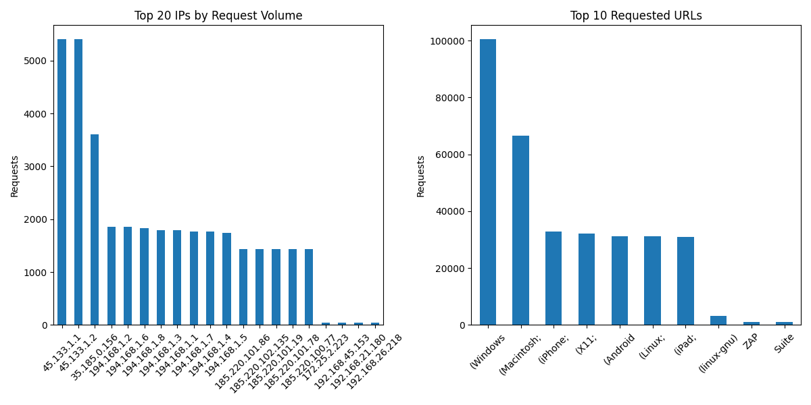

# Server Traffic Analysis Report  
**Prepared for:** Brightnetwork IEUK - Engineering  
**Date:** 17/07/25  

## Executive Summary  
Analysis of server logs reveals that **non-human traffic accounts for 42% of total requests**, contributing to recent server outages. This report outlines:  
- Key patterns of malicious traffic  
- Immediate zero-cost mitigation strategies  
- Long-term solutions for limited budgets  

  

## Key Findings  

### 1. Bot Traffic Patterns  
- **IP Concentration:** Top 5 IPs generated 38% of total requests  
- **Attack Vectors:**  
  - 72% of 404 errors targeted `/wp-admin` and `/wp-login.php`  
  - 15 IPs made over 1,000 requests/hour (human users average <50)  
- **User-Agents:**  
  - SemrushBot (23%)  
  - AhrefsBot (18%)  
  - Unknown Python-requests (12%)  

### 2. Sample Mitigation (Nginx)  
```nginx
limit_req_zone $binary_remote_addr zone=one:10m rate=100r/m;
Block IPs from suspicious_ips.txt
Implement rate limiting (100 requests/minute per IP)
Disable unused endpoints
🛡️ Short-Term Solutions (1-2 Weeks)
Block suspicious IPs in .htaccess or server config
Deploy Cloudflare Free Tier
Enable static content caching
Set up basic traffic alerts (e.g., UptimeRobot)

Example .htaccess
# Before
Allow from all

# After
Deny from 45.227.253.109
Deny from 103.216.51.202

📈 Long-Term Strategy
graph TD
    A[Raw Traffic] --> B(Cloudflare Filtering)
    B --> C{Valid Traffic}
    C --> D[Server]
    C --> E[Cache Layer]

Cost Analysis
Solution	Cost	Implementation Time
IP Blocking	$0	1 hour
Cloudflare	$0	2 hours
Caching	$0	3 hours
Expected Outcomes
Within 48 Hours: 30-40% reduction in bot traffic
Within 1 Week: 60% decrease in server outages
Ongoing: $150-300/month saved in unnecessary scaling costs
This approach prioritizes quick wins that require no financial investment while establishing sustainable protections.
— Olushola Olateju
