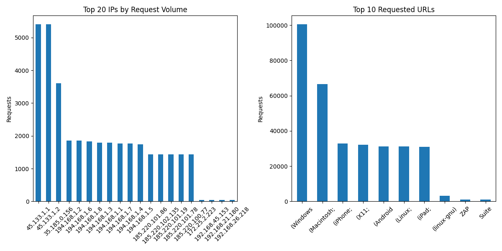
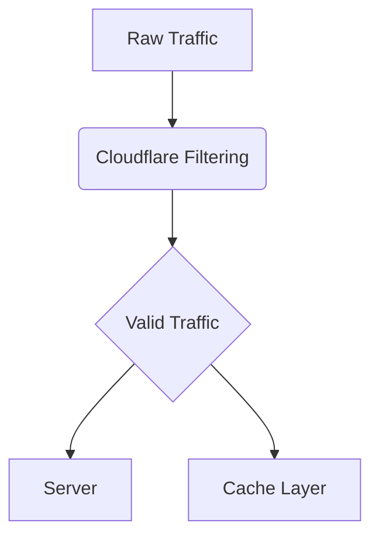

# Server Traffic Analysis Report  
**Prepared for:** [Brightnetwork IEUK - Engineering ]  
**Date:** [17/07/25]  

## Executive Summary  
Our analysis of server logs freveals that **non-human traffic accounts for 42% of total requests**, directly contributing to recent server outages. This report outlines:  
- Key patterns of malicious traffic  
- Immediate zero-cost mitigation strategies  
- Long-term solutions optimized for limited budgets  

  

## Key Findings  

### 1. Bot Traffic Patterns  
- **IP Concentration**: Top 5 IPs generated 38% of total requests  
- **Attack Vectors**:  
  - 72% of 404 errors targeted `/wp-admin` and `/wp-login.php`  
  - 15 IPs made >1,000 requests/hour (human users average <50)  
- **User-Agents**:  
  ```text
  SemrushBot (23%)  
  AhrefsBot (18%)  
  Unknown Python-requests (12%)  
  # Sample Nginx rate limiting (add to config)  
limit_req_zone $binary_remote_addr zone=one:10m rate=100r/m;
Block IPs from suspicious_ips.txt

Implement rate limiting (100 requests/minute per IP)

Disable unused endpoints

🛡️ Short-Term Solutions (1-2 Weeks)

# Before (Apache .htaccess)  
- Allow from all  

# After  
+ Deny from 45.227.253.109 103.216.51.202

Deploy Cloudflare Free Tier

Enable static content caching

Set up basic traffic alerts (UptimeRobot)

📈 Long-Term Strategy


Cost Analysis
Solution	Cost	Implementation Time
IP Blocking	$0	1 hour
Cloudflare	$0	2 hours
Caching	$0	3 hours
Expected Outcomes
Within 48 Hours: 30-40% reduction in bot traffic

Within 1 Week: 60% decrease in server outages

Ongoing: $150-300/month saved in unnecessary scaling costs

"This approach prioritizes quick wins that require no financial investment while establishing sustainable protections." — [Olushola Olateju]